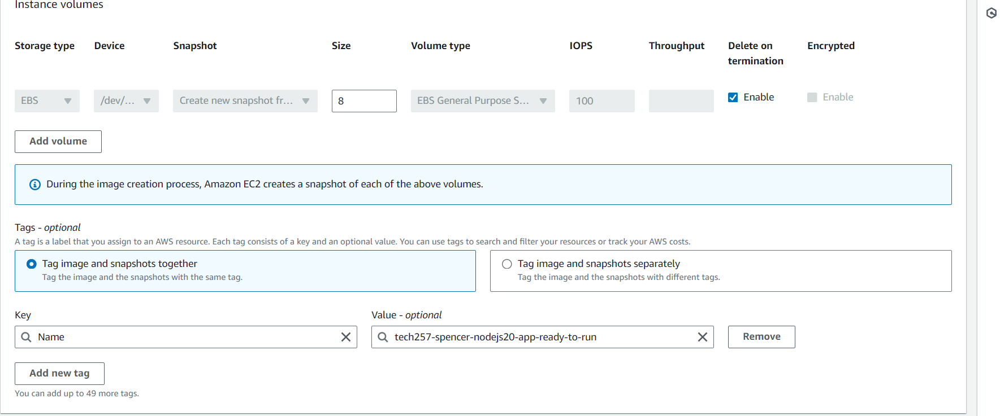

# Amazon Machine Image - AMI

## Set-up and deletion
- Snapshot of a previous virtual machine.
- Easy to create on AWS.
 

 
- Have to wait for it to stop pending before deleting the old vm or deleting. 
 
- Have to  deregister the AMI then also delete the snapshot.
- When creating a new EC2 from image use small amount of user data to get the app running.

## Differences in creating AWS AMI's and Azure VM Images:

### Creating an AMI (AWS):

- Prepare your VM: Ensure the VM you want to capture is configured with the desired OS, applications, and settings.
  
- Create an AMI: You can use the AWS Management Console, AWS CLI, or AWS SDKs to initiate the AMI creation process. This process creates a snapshot of the entire VM.
  
- Configure AMI Properties (Optional): You can optionally define properties like name, description, and access permissions for the AMI.
  
- Wait for Completion: The AMI creation process might take some time depending on the size of your VM.

### Creating a VM Image (Azure):

- Prepare your VM: Configure your VM with the desired OS and configuration. Data disks, if used, should be attached separately.
  
- Generalize the VM (Optional): This step removes VM-specific information like hostname and temporary files to prepare it for wider use. It's optional but recommended for custom images.
  
- Capture the VM Image: Use the Azure portal, Azure CLI, or Azure PowerShell to capture the VM image. This captures the OS and configuration, not data disks.

- Configure Image Properties: Define properties like name, description, and OS type for your VM image.

- Optional: Manage Sharing: You can choose to make your custom image private for your use or share it publicly in the Azure Marketplace.

### Key Differences in Steps:

- Data Disks: AWS includes data disks in the AMI snapshot, while Azure manages them separately with Managed Disks.

- Generalization: Generalization is optional in AWS but recommended in Azure for custom images to remove VM-specific details.

- Sharing: Sharing options are more prominent in Azure, allowing you to publish custom images to the Azure Marketplace.

- Overall, both processes involve capturing the VM's core functionality, but AWS offers a more self-contained solution with data disks included, while Azure provides more flexibility with separate storage and a focus on infrastructure as code through ARM templates.

## Differences between AWS AMI's and Azure VM Images
### Scope of Capture:

- AMI (AWS): Captures the entire state of a virtual machine, including the operating system, applications, configurations, and data disks. It's a complete snapshot at a specific time.

- Azure VM Image: Focuses on capturing the operating system and configuration of the VM. Data disks are typically handled separately using Managed Disks.

### Customization:

- AMI (AWS): You can create custom AMIs from existing, running VMs that you've configured to your needs. This includes OS, applications, and data.

- Azure VM Image: While you can create custom VM images from existing VMs, they only capture the OS and configuration, not any data stored on the VM itself (which would reside on separate Managed Disks). Azure Marketplace offers pre-built VM images with various OS and application configurations.

### Data Persistence:

- AMI (AWS): Data is captured within the AMI itself, making it a self-contained unit.

- Azure VM Image: Data isn't directly captured in the VM image. You need to manage data persistence through separate Managed Disks which can be attached to different VMs for a consistent environment.

### Infrastructure Definition:

- AMI (AWS): AMIs are primarily focused on capturing the VM state itself. Infrastructure definition is handled through separate tools.

- Azure VM Image: Azure uses Resource Manager Templates (ARM templates) to define your infrastructure, including VMs, their configurations, and the virtual networks they connect to.  ARM templates offer a more code-driven approach to infrastructure management.

### In essence:

- AWS AMIs: Offer a more comprehensive solution by capturing the entire VM state, making them easier to deploy in their entirety.

- Azure VM Images: Provide more flexibility with separate storage disks and a focus on infrastructure as code through ARM templates.