# Auto Scaling Group
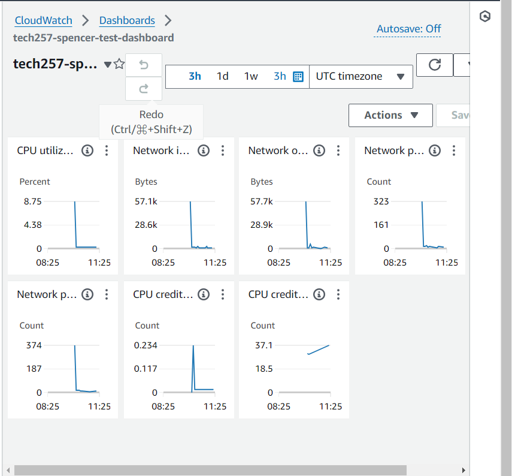 

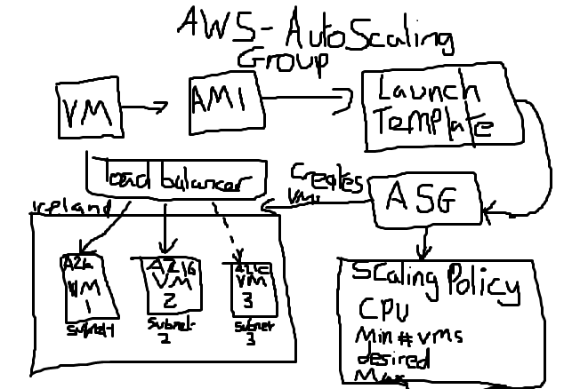

- Main differences to Azure:
  - Launch template
  - Seperate Subnets

## Launch Template
- We need to create a launch template first: 
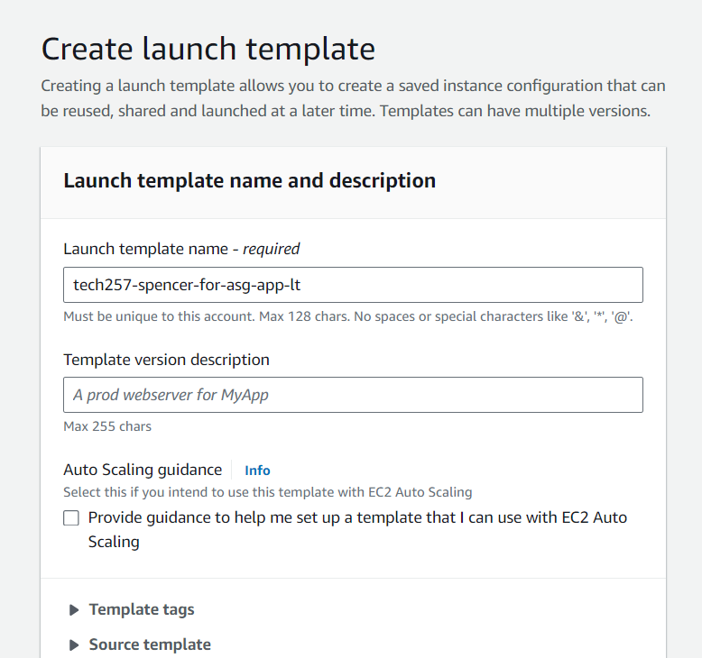  
- Make sure you add the ami we created earlier: 
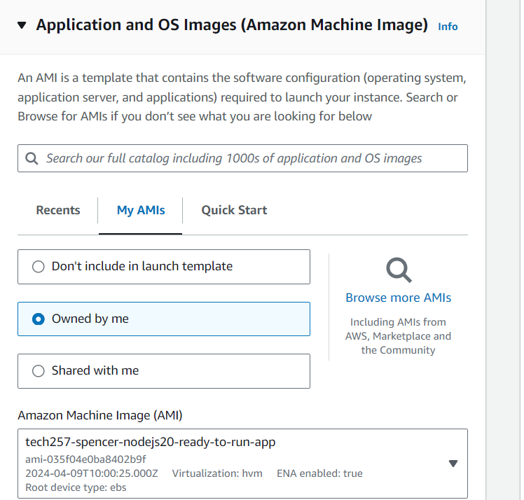  
- Add the correct Key Pair:  
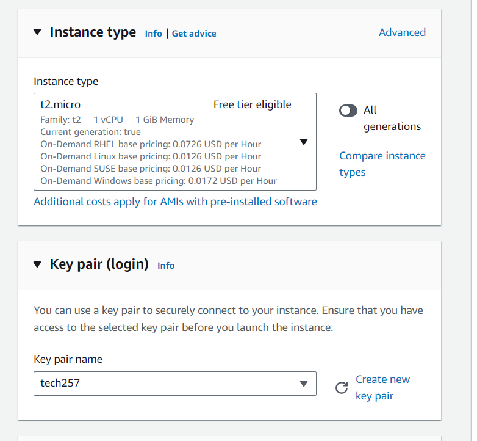  
- Choose the correct security group for our instances needs: 
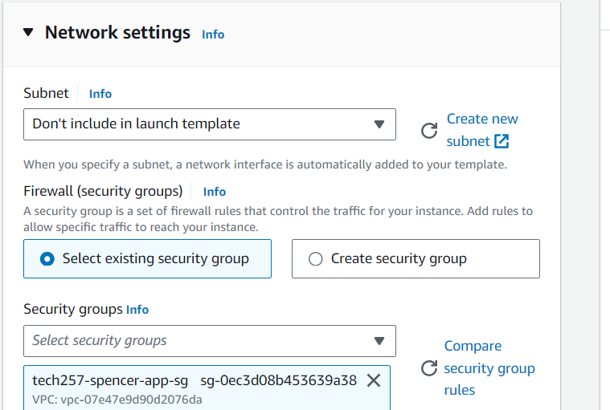  

## Create the Auto Scaling Group
- Give it an appropriate name and select our Launch Template:  
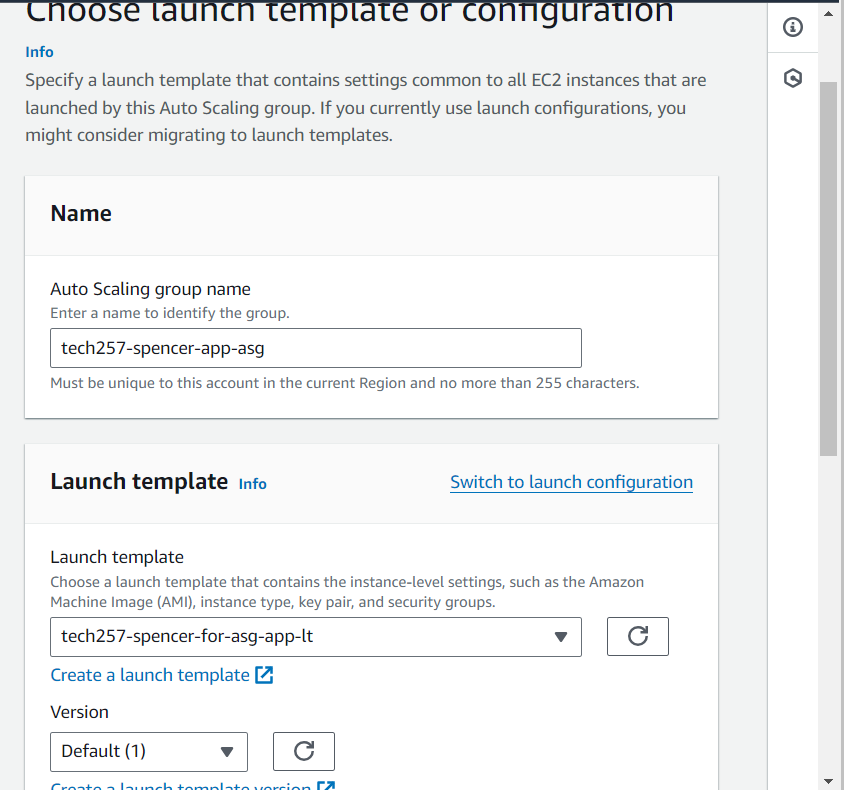  
- We are using a default VPC but selecting AZ and subnets: 
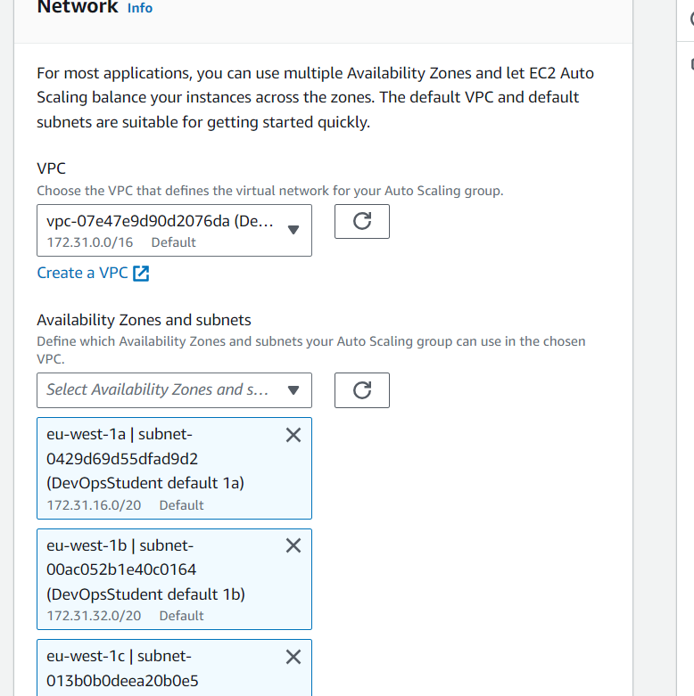 
- Attach a new load balancer:  
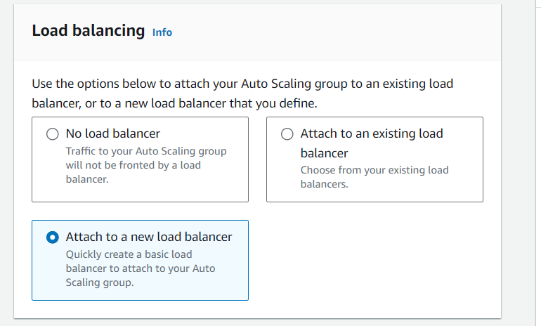 
  - New Load Balancer set up: 
    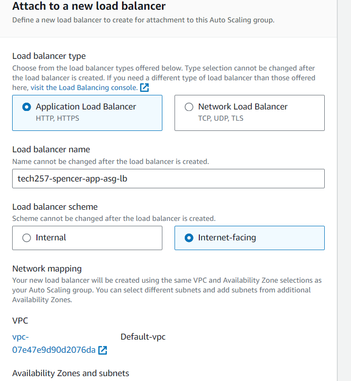 
    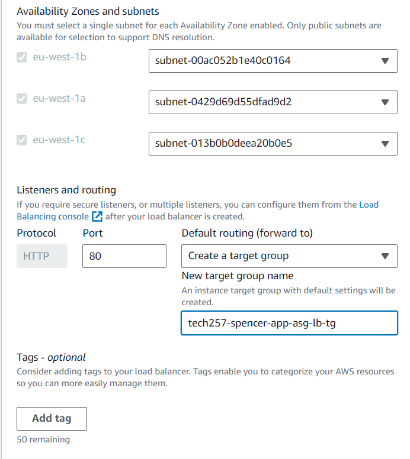 

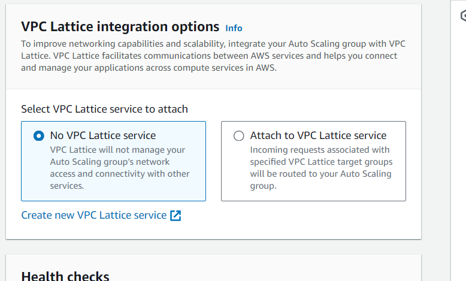 
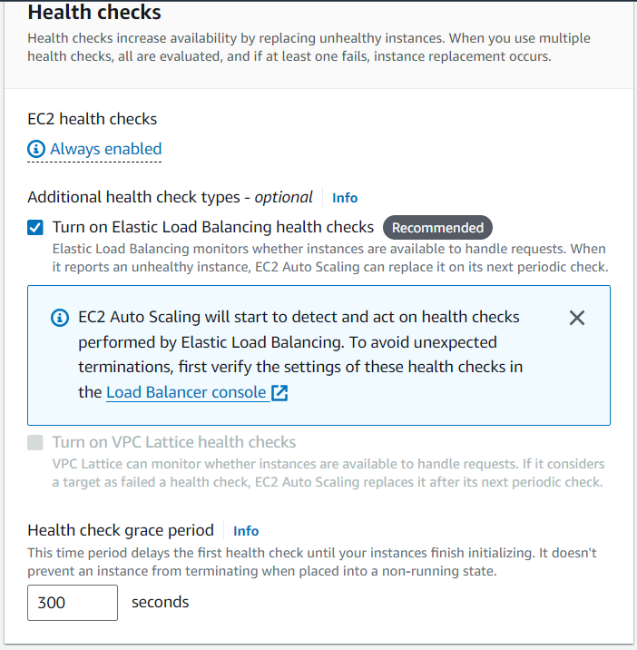 
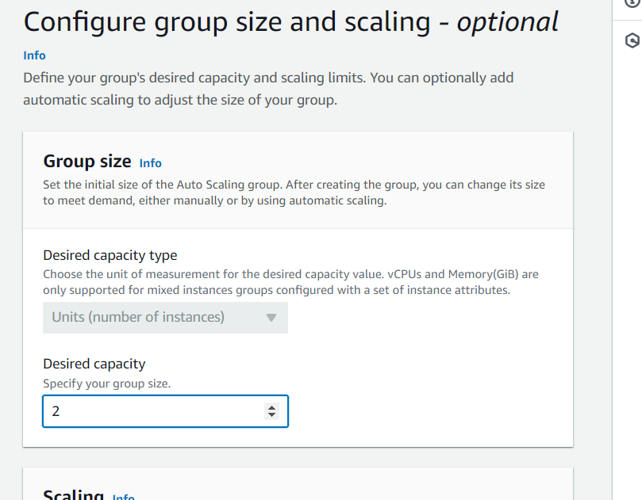 
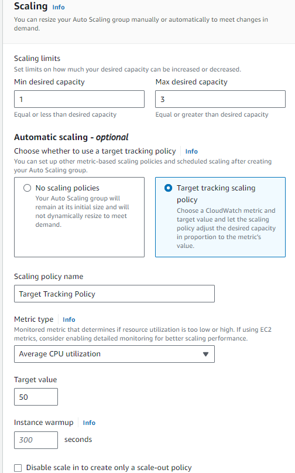 
