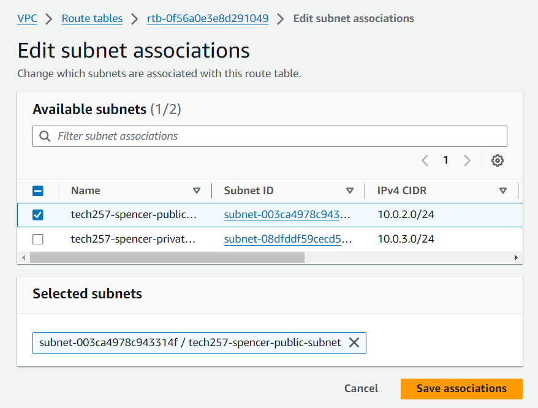

# Custom VPC's

 

- [Custom VPC's](#custom-vpcs)
  - [What is a custom VPC?](#what-is-a-custom-vpc)
  - [Why use one?](#why-use-one)
  - [When to use one?](#when-to-use-one)
  - [How to create one:](#how-to-create-one)
  - [Numbere Diagram](#numbere-diagram)
  - [Deleting a Custom VPC](#deleting-a-custom-vpc)

 

 

## What is a custom VPC?
In Amazon Web Services (AWS), a custom VPC is a virtual network that you create and configure according to your specific needs. Unlike the default VPC provided by AWS, which has a predefined IP address range and limited customization, a custom VPC offers greater control over:

  - IP Address Range: You can select a private IP address range (CIDR block) that aligns with your existing network infrastructure or future growth requirements.
  - Subnet Creation: You can define subnets within your VPC, segmenting your network into logically isolated parts. Each subnet can have a different IP address range and security group configuration, enabling granular control over resource placement and access.
  - Security Groups: You can create and apply security groups to control inbound and outbound traffic for your resources within the VPC. This allows you to define precise access rules for enhanced security.
  - Network Gateways: You can configure various network gateways to manage traffic flow within the VPC and between the VPC and the internet or your on-premises network. Here are the common ones:
    - Internet Gateway (IGW): Enables resources in your VPC to access the internet.
    - NAT Gateway (NAT): Provides outbound internet access for resources in private subnets without exposing them directly to the internet.
    - VPN Gateway: Enables secure communication between your VPC and your on-premises network.

 

## Why use one?
There are several compelling reasons to create and use a custom VPC in AWS:

  - Security: Custom VPCs allow for a more secure network environment by isolating your resources from the public internet and other VPCs. You can define strict security groups, control traffic flow, and potentially meet regulatory compliance requirements.
  - Scalability: By creating subnets with appropriate IP address ranges, you can easily scale your resources within the VPC to accommodate future growth without having to redesign your entire network architecture.
  - Cost Optimization: You can optimize costs by selectively assigning public IP addresses only to resources that need direct internet access. Private subnets can leverage NAT gateways for outbound internet traffic, reducing the need for public IP addresses.
  - Network Segmentation: Subnets within a VPC enable you to segment your network based on function, resource types, or security levels. This improves organization and simplifies network management.
  - Integration with On-Premises Networks: Custom VPCs facilitate secure communication between your AWS resources and your on-premises network using a VPN gateway.

 

## When to use one?
In most cases, using a custom VPC is preferable to the default VPC. Here are some specific scenarios where a custom VPC is highly recommended:

  - Production Environment: For production deployments in AWS, a custom VPC is essential for enhanced security, network control, and scalability.
  - Multi-Tier Applications: When your application has separate tiers for web servers, database servers, and other components, a custom VPC allows you to segment the network for improved security and manageability.
  - Compliance Requirements: If your organization must adhere to strict data security regulations, a custom VPC with specific security controls is necessary.
  - Integration with On-Premises Networks: If you need to establish a secure connection between your AWS resources and your on-premises network for data transfer or application integration, a custom VPC with a VPN gateway is the way to go.
 
Additional Considerations:

  - Complexity: While offering greater control, custom VPCs can introduce some management complexity compared to the default VPC. Careful planning and configuration are required to ensure desired network behavior and security.
  - Cost: Depending on your usage, there might be slight costs associated with resources like NAT gateways and internet gateways in a custom VPC. However, the potential security and scalability benefits often outweigh these costs.

 

## How to create one:
1. Create VPC, select create VPC only:  
     
2. Create a public and a private Subnet: 
     
     
     
3. Create an Internet Gateway and assign it to your VPC: 
     
     
4. Create a Public Route Table: 
     
   1. Associate it with the public subnet: 
         
   2. Edit routes to add the Internet Gateway: 
         
5. Create your EC2 Instances: 
   1. Database first so you have the private IP for the app User Data, select your ami, key pair, no public ip, VPC and create a new security group with SSH and another rule so your app can access your DB port: 
         
   2. App, select app AMI, key pair, enable public ip, vpc, create new security group with HTTP and SSH make sure to add User Data as required: 
         
         

You want your Resource Map to look like this: 
 

## Numbered Diagram

## Deleting a Custom VPC
Order to delete:
1. VMs.
2. Security groups.
3. VPC - this also deletes subnets, internet gateway and route table.