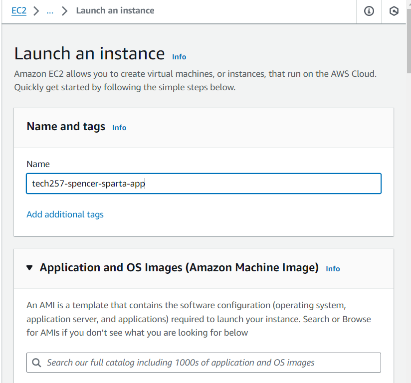
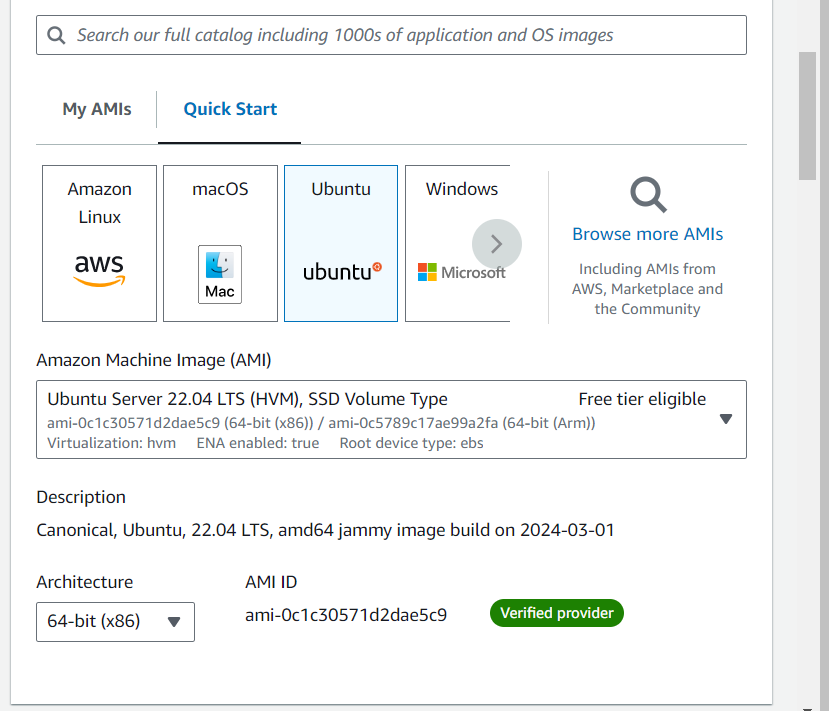
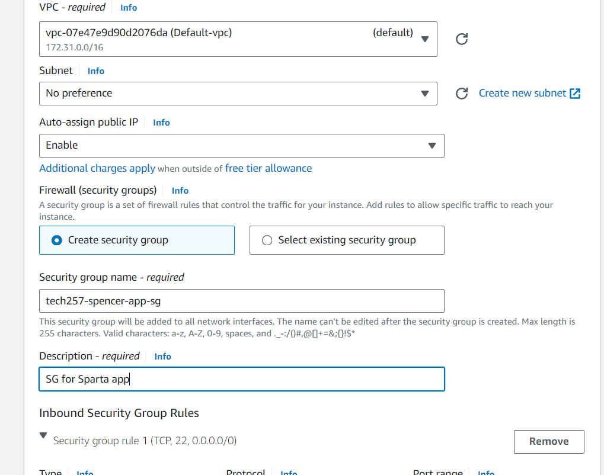
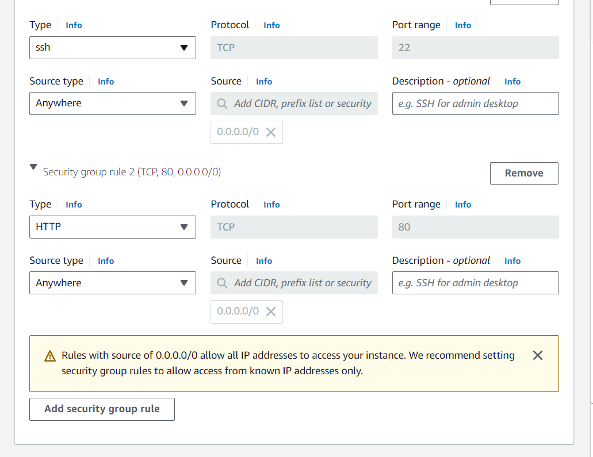
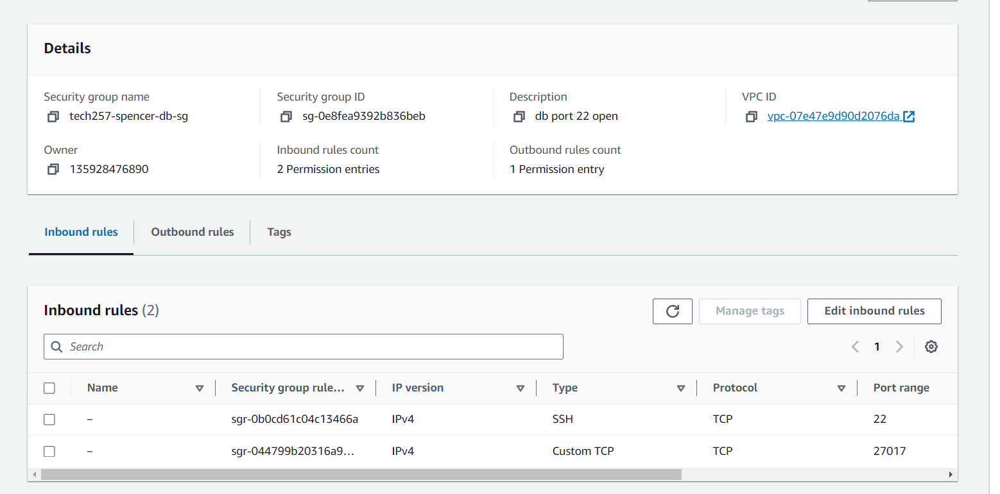

# Launching a VM in AWS using EC2

1. Select EC2
2. Select Launch new Instance
3. 
4. Select the Ubuntu 22.04 image
5. 
6. Select your Key Pair and make sure it's in your local machines .ssh folder
7. Create a new Security group (or use existing if you've set one up previously)
8. 
9. 
10. SSH into your new instance
11. - Change this file:
    - `sudo nano /etc/needrestart/needrestart.conf`
    - From:
        - `#$nrconf{restart} = 'i';`
        - Uncomment and change to:
        - `$nrconf{restart} = 'a';` to restart services automatically.
12. Run through your script to install dependencies and start the app. [Script to install Sparta app.](install_sparta_app_script.sh)

## Connecting the Database

1. Create a new instance following the above example
2. Add a new security group:
3. Make sure to open port 22 and port 27017
4. 
5. Run your setup script to install mongo and all your dependencies: [Database Setup Script](install_sparta_db.sh)
6. Connect the app to the db using the DB_HOST same rules as in Azure putting your ip and port in the env variable.
7. Make sure to npm install again to seed and all should be connected and run pm2 kill and pm2 start app.js